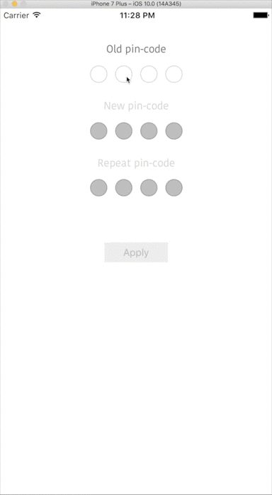

# QUIckControl
Base class for quick implementation UIControl subclass based on standard(enabled, highlighted, selected) and custom states.
Implementation based on KVC.

You may to bind value for specific target with state of types:
 - simple state as bitmask (UIControlState);
 - state, which contains in current state (.intersected);
 - all states, which not matched specified state (.inverted);
 - all states, where current state contains one or more specified substates (.oneOfSeveral);
 - all states, where current state not contains specified substates (.noneOfThis);
 - custom state, which you implemented (.custom);
 
All state types have priority and value setup from most high priority state.
In default implementation simple state have priority 1000, intersected 999, inverted 750, oneOfSeveral and noneOfThis 500, custom user defined.

Example usage:

In most cases, state looks like bool property or him may be represented in bool property. So, before setup value for state, it need register using:
```swift
func register(_ state: UIControlState, forBoolKeyPath keyPath: String, inverted: Bool)
```
example:
```swift
register(.disabled, forBoolKeyPath: #keyPath(UIControl.enabled), inverted: true)
```

Immediately, after registration you may setup values for this state using:
```swift
func setValue(_ value: Any?, forTarget: NSObject, forKeyPath: String, forInvertedState: UIControlState) {
func setValue(_ value: Any?, forTarget: NSObject, forKeyPath: String, forAllStatesContained: UIControlState)  
func setValue(_ value: Any?, forTarget: NSObject, forKeyPath: String, for: UIControlState)
func setValue(_ value: Any?, forTarget: NSObject, forKeyPath: String, for: QUICState)
```
examples:
```swift
control.setValue(UIColor.black, forKeyPath: #keyPath(UIView.backgroundColor), forAllStatesContained: .highlighted)
control.setValue("QuickControl sended this string",
                 forTarget:receiver
                 forKeyPath: #keyPath(StringReceiver.value),
                 for: QUICState(priority: 1001, function: { $0.contains(.invalid) || $0 == .highlighted }))
```

# PinCodeControl



QUIckControl subclass, which is used for input PIN code. It uses programming states for change visual view.
